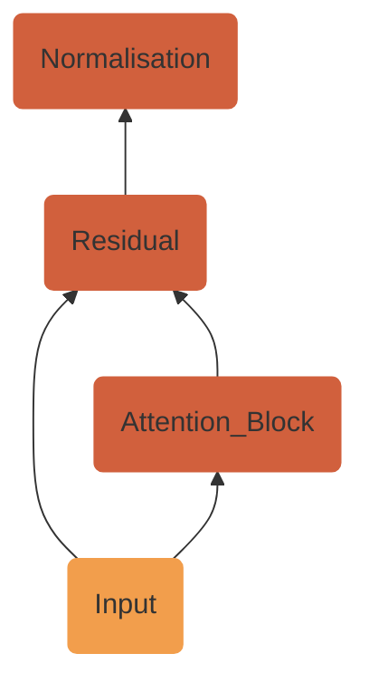

# Makespeare
Makespeare is a GPT-style transformer that I coded from scratch and trained on the tiny-shakespeare dataset. This idea is inspired by Andrej Karpathy's video (https://youtu.be/kCc8FmEb1nY) which I used a reference only to overcome certain obstacles. 

## 🛠️ Tools
  

## 📑 Data
The transformer was trained on the `tiny-shakespeare` dataset containing 40,000 lines of text from Shakespeare's plays. Click [here](https://raw.githubusercontent.com/bl0nder/makespeare_datasets/main/shakespeare_input.txt) for the dataset.

An excerpt from the dataset:
```
First Citizen:
Before we proceed any further, hear me speak.

All:
Speak, speak.

First Citizen:
You are all resolved rather to die than to famish?

All:
Resolved. resolved.

First Citizen:
First, you know Caius Marcius is chief enemy to the people.

All:
We know't, we know't.
...
```

## Transformer Architecture
### Input Embedding
For the transformer to be able to interpret text, we need to convert the input text into something a computer can understand - :sparkles:Numbers:sparkles:. This is done by:

#### 1. Tokenisation
- Splitting up text into multiple parts or **tokens**
#### 2. Encoding:
- Giving a unique numerical ID to each unique token
- Thus, every unique word is mapped to a unique numerical ID.
- In practice, a dictionary is used to keep track of the ID of each word. The number of word-ID pairs present in the dictionary is known as its **vocabulary size** (referred to as `vocab_size` in the code).
  
| Word  | ID |
| ------------- | ------------- |
| Cat  | 1  |
| Dog  | 2  |
| ... | ...|

- If a word that is not present in the dictionary is encountered, special rules are followed to assign an ID to it.
#### 3. Vectorisation: 
- Converting each token into a learnable n-dimensional vector
- For example, how similar two words are can be measured by the distance between their corresponding points in n-dimensional space (similarity increases the closer the points are).
- The dimension of each such vector is fixed and corresponds to `embedding_len` in the code. Some sources also refer to this as `d_model` (model dimension).

### Positional Embedding
Matrix of learnable vectors that represent the respective position of each token in a sentence. 

Such embeddings allow the transformer to learn how words need to be in a certain order to make sense in a sentence.

### Encoder
#### Multi-Head Dot Product Self Attention
Mechanism through which the model can learn which words to focus on in a particular sentence. Attention is computed by:
1. Generating 3 matrices, namely, the Query (Q), Key (K) and Value (V) as follows:

$$Q = X \cdot W_Q$$

$$K = X \cdot W_K$$

$$V = X \cdot W_V$$

where 

$X =$ Matrix contaning input embedding vectors 👉 `(context_length, embedding_len)`

$W_Q, W_K, W_V =$ Matrices with separately learnable weights 👉 `(embedding_len, embedding_len)`

2. Splitting the Query, Key and Value matrices into `num_head` heads
3. Computing attention on each head as follows:

$$Attention(Q,K,V) = Softmax(\frac{QK^T}{\sqrt d_k})V$$

where

$d_k =$ Dimension of each vector in $K$

4. Concatenating the attention values calculated for each head into a single attention matrix

#### Residual Connection & Normalisation

The computed attention matrix is added to the attention block's input matrix. This is known as a **residual connection**.

The residual output then undergoes normalisation for better and faster training.

Note: Makespeare makes use of a slightly modified version of this step wherein the attention block's input matrix undergoes normalisation, the attention matrix is computed using this normalised input, and finally, a the residual computation is performed. This is simply a rearrangement of the aforementioned order of steps as follows:


